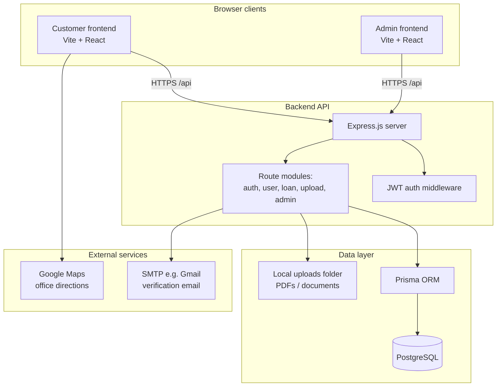

# System architecture — AUNTY D (Loan application)

This document describes how the customer site, admin app, API, database, and file storage fit together.

---

## 1. High-level diagram

---

## 2. Logical components

| Component | Role |
|-----------|------|
| **Customer frontend** | Public and authenticated borrower UI: marketing home, loan types, multi-step apply, profile, loan status, history, auth. |
| **Admin frontend** | Staff-only UI: dashboard, loan list/detail, decisions and status transitions. Requires `role === admin` from login. |
| **Backend API** | Single REST API (`/api/...`). Handles auth, users, loans, uploads, and admin operations. |
| **PostgreSQL** | Persistent storage for users, loans, documents metadata, guarantors, activity/messages. |
| **File storage** | Uploaded files (e.g. PDFs) stored on the server filesystem under `uploads/` and served as static files. |
| **Email** | Optional SMTP for signup verification and related mail (configurable via env). |

---

## 3. Request flow (typical)

1. **Browser** loads a SPA (customer or admin). API calls use `VITE_API_BASE` (production) or dev proxy to the backend.
2. **Express** parses JSON and multipart uploads; **CORS** allows browser origins.
3. **Auth:** Protected routes use `Authorization: Bearer <JWT>`. The token encodes `userId`; middleware loads the user and attaches `role` for admin checks.
4. **Business logic** lives in route handlers; **Prisma** runs queries against PostgreSQL.
5. **Responses** are JSON; file links point to `/uploads/...` on the backend origin so PDFs open from the correct host.

---

## 4. API surface (conceptual)

| Prefix | Purpose |
|--------|---------|
| `/api/auth/*` | Signup, login, email verification, resend verification. |
| `/api/user/*` | Authenticated user profile and related updates. |
| `/api/loan/*` | Loan applications, status, stats (customer). |
| `/api/upload/*` | Document uploads tied to loans/users. |
| `/api/admin/*` | Admin-only loan listing, detail, decisions, operational actions. |

Exact paths are defined in `backend/src/index.ts` and the files under `backend/src/routes/`.

---

## 5. Deployment topology (typical)

| Layer | Common hosting |
|-------|----------------|
| Customer + admin frontends | Static hosting (e.g. **Vercel**), each app built from its own folder. |
| Backend | Node process (e.g. **Render**): `npm run build` then `npm start`. |
| Database | Managed **PostgreSQL** (e.g. **Neon**). Connection string in `DATABASE_URL`. |

Environment variables connect the pieces: `DATABASE_URL`, `JWT_SECRET`, `VITE_API_BASE` on the frontends, optional `SMTP_*`, `FRONTEND_URL`, `DISABLE_EMAIL_VERIFY`, etc.

---

## 6. Security notes (architecture-level)

- Passwords are hashed (bcrypt) before storage.
- JWTs authenticate API requests; admin routes additionally require `admin` role.
- Secrets and DB credentials live in environment variables, not in the repository.

---

*For library and framework names, see `TECH_STACK.md`.*
